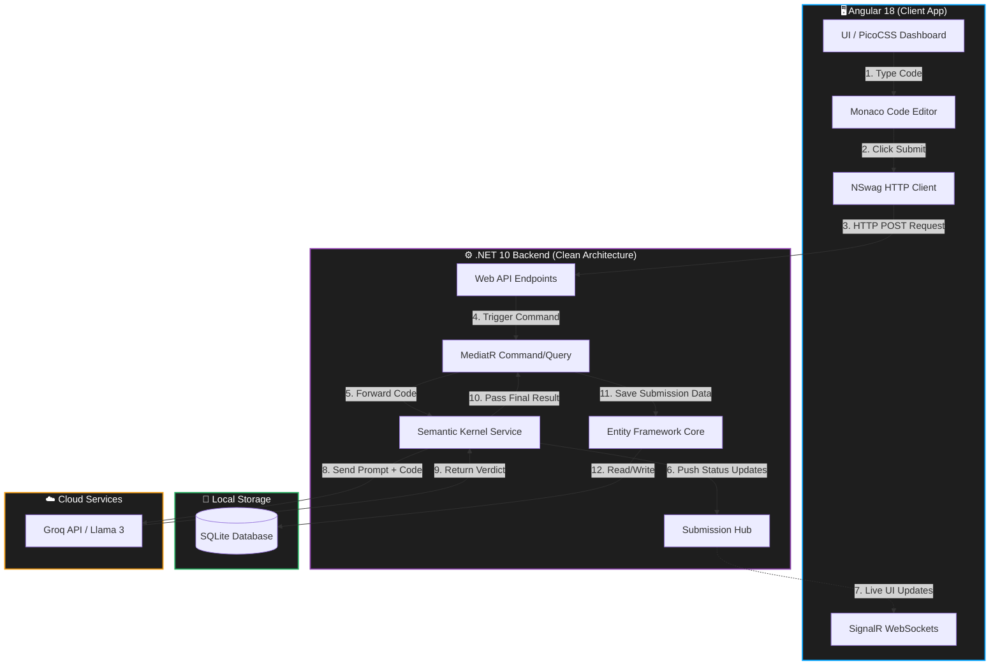

# CodeArena Architecture & Data Flow

Bhai, yeh raha aapke CodeArena project ka complete Architecture Diagram. Isme clean architecture, WebSockets, aur AI integration ka pura flow dikhaya gaya hai.

### 🧠 Kaun Kisse Connect Karta Hai (The Flow)

Chalo isko ek real example (Code Submit karna) se samajhte hain:

1. **User Input (Angular & Monaco):** 
   User Monaco Editor (VS Code jaisa UI) mein apna solution likhta hai aur "Submit" dabata hai.
2. **Frontend to Backend (NSwag):** 
   Angular ka `NSwag` client automatically us code ko uthata hai, JSON mein pack karta hai, aur backend (C# API) ko ek `HTTP POST` request bhejta hai.
3. **Backend Processing (MediatR & Clean Architecture):** 
   Request .NET API par aati hai. Humara backend **MediatR** (CQRS pattern) use karta hai. API seedha `EvaluateSubmissionCommand` ko kaam de deti hai.
4. **Live Loading (SignalR WebSockets):** 
   Jaise hi command start hoti hai, Backend ka **SignalR Hub** ek two-way connection (WebSocket) open rakhta hai. Yeh frontend ko chupke se live messages bhejta hai ("Compiling...", "Analyzing with AI..."). Frontend ka `SignalR_Client` usko pakad ke screen par live loading text change karta hai.
5. **AI Magic (Semantic Kernel to Groq):** 
   Command code ko `SemanticKernelJudgeService` ko bhejti hai. Semantic Kernel us code ko ek prompt ke sath **Groq API** (Llama 3) par internet ke through HTTP request bhejta hai. Groq code ko check karke result wapas C# backend ko deta hai.
6. **Saving to DB (EF Core to SQLite):** 
   C# backend Regex lagakar Groq ke answer (Pass/Fail) ko nikalta hai. Phir **Entity Framework (EF) Core** ko order deta hai ki "Is result ko save karo". EF Core SQL query banakar usko **SQLite Database** (`CodeArena.db`) mein likh deta hai.
7. **Final UI Update:** 
   Backend frontend ko HTTP request ka final success response deta hai, aur user ke dashboard par green/red tick aa jata hai!

Bhai, yeh architecture bilkul enterprise-level companies (jaise Microsoft/Amazon) wala hai. Isme frontend, backend, aur database ek doosre se strongly "decoupled" (alag) hain!
